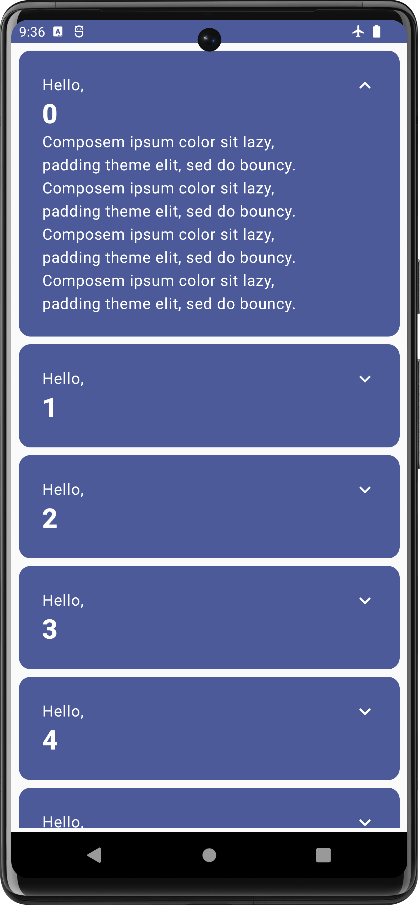
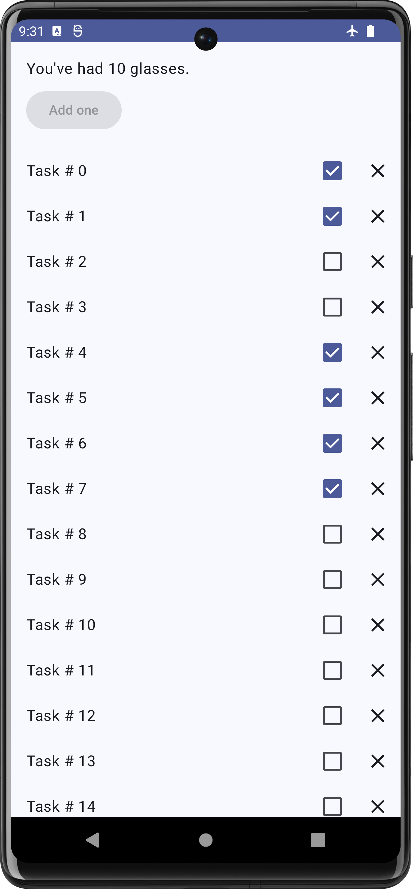

# Compose Code Examples
In this repository you can find multiple basic compose codelab app samples all
samples are divided into corresponding branches.

### code-along-demo

**In this branch we build very simple ```Scrollable List using LazyColumn with animation``` in compose Link to
official [Compose Tutorial](https://developer.android.com/develop/ui/compose/tutorial)**



### compose-layout

**In this branch we will learn how to build a ```complex layouts``` in compose
Link to official [codelab](https://developer.android.com/codelabs/jetpack-compose-layouts)**


### compose-state

**In this branch we will digger deeper into ```compose state``` Link to
official [codelab](https://developer.android.com/codelabs/jetpack-compose-state)**

